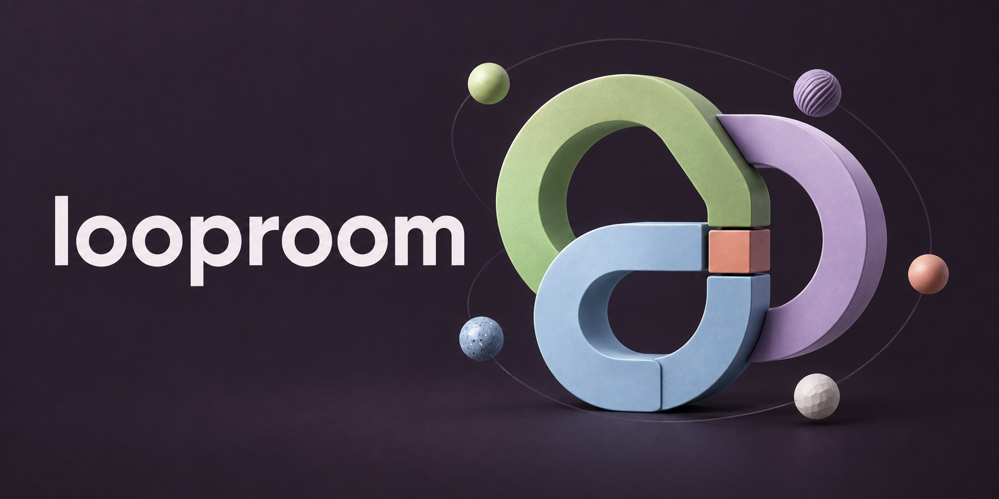
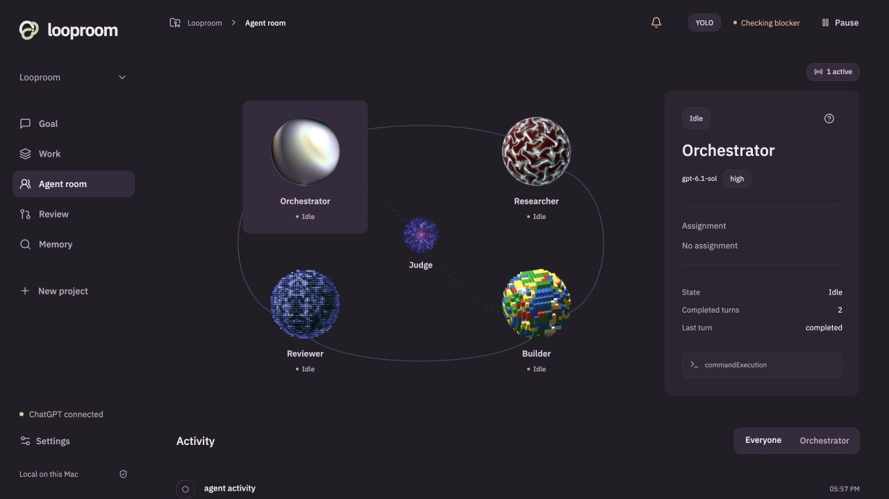
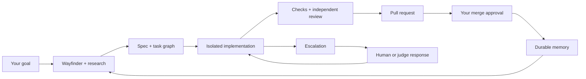

# Looproom

**Agents work together. You approve the merge.**

Looproom is a local macOS workspace for goal-directed coding agents. Give it a project and an outcome. Follow the conversation, watch agents work in isolated Git worktrees, inspect their evidence, and approve the pull requests you want to ship.

[Get started](#get-started) · [How it works](#how-it-works) · [Contribute](CONTRIBUTING.md) · [Roadmap](docs/roadmap.md) · [Report a bug](https://github.com/thiago-ss/looproom/issues/new/choose)

> **Early alpha.** Working software, with real agent runs and a verified GitHub PR flow. Expect rough edges. General autonomous self-improvement, a complete browser benchmark, and a signed macOS package are still work in progress.

## A workspace for the whole loop

- **Start with a goal.** A persistent conversation carries the brief, agent escalations, and attributed human or judge replies.
- **See the work.** A task frontier, dependency graph, and agent room connect each role to its actual activity.
- **Keep changes isolated.** Each task has its own worktree. The coordinator runs configured checks and a separate agent review before publishing.
- **Choose your autonomy.** Keep judge suggestions for human review, let the judge handle routine choices, or use YOLO for automatic non-PR responses. Independent work continues while a task waits.
- **Keep the evidence.** SQLite, FTS5 search, immutable run records, and a source-linked wiki retain outcomes across sessions.
- **Own every merge.** Review shows the PR, diff, checks, and revision. A changed head requires fresh approval—even in YOLO.



*Actual application screenshot. Agent activity reflects the captured session; this is not a UI mockup.*

## Get started

You need **macOS**, **Node 22.13+**, **Git 2.35+**, **Codex CLI 0.159.2+** with named permission profiles, and **Apple Command Line Tools**. GitHub CLI authentication is needed to publish and merge PRs. [Full setup and troubleshooting →](docs/getting-started.md)

```sh
git clone https://github.com/thiago-ss/looproom.git
cd looproom
npm ci
npm run dev
```

Open **http://127.0.0.1:5173**.

1. Choose an existing repository or a new project folder with the native Finder picker.
2. Connect through **Sign in with ChatGPT** in setup or Settings.
3. Describe the goal, set boundaries and check commands, then start the loop.
4. Follow progress in **Work** and **Agent room**. Resolve decisions and approve PRs in **Review**.

Looproom keeps its own Codex account storage. ChatGPT access, model availability, and usage limits depend on your account. The workspace runs locally; model requests use OpenAI services. It is not an offline inference engine or an unlimited subscription workaround. See [OpenAI's authentication documentation](https://learn.chatgpt.com/docs/auth).

Defaults are **GPT-6.1 Sol / High** for orchestration and **GPT-6 Sol / Medium** for workers and the judge. Select models available to your account in Settings; unavailable models produce an explicit gate.

## How it works



A single coordinator owns dispatch, SQLite writes, verification, and publication. One to four concurrent workflows share capacity across planning, workers, and judges. Gates affect the blocked task and its real dependents; they do not automatically freeze unrelated work.

The workflow adapts [Matt Pocock's skills](https://github.com/mattpocock/skills), uses [Ponytail](https://github.com/dietrichgebert/ponytail) to favor reuse, and draws on Karpathy's [autoresearch](https://github.com/karpathy/autoresearch) and [LLM Wiki](https://gist.github.com/karpathy/442a6bf555914893e9891c11519de94f) ideas. [Read the implemented contract →](docs/workflows/looproom-v1.md)

## Know the boundaries

| Available now | Still being developed |
|---|---|
| Local UI, SQLite memory, real Codex turns | Signed native macOS distribution |
| Isolated worktrees, checks, separate review, human PR merges | Broader simultaneous native pipeline validation |
| Task-scoped gates and automatic judge replies | Guaranteed resolution of every blocker |
| Bounded experiment ledger and a guarded refresh recipe | General experiment harness and proven self-improvement |
| Read-only browser evidence broker | Complete representative browser baseline |
| FTS5 and source-linked outcome memory | Jev retrieval evaluation and deeper contradiction review |

YOLO cannot create missing capabilities or widen worker permissions. Restart interruptions still need human review. Continuous work requires the coordinator to stay running; macOS sleep suspends it. When there is no evidenced next improvement, the loop waits instead of manufacturing tasks.

## Contribute

Bring a reproducible bug, improve onboarding, test a real repository, strengthen accessibility, or help with the [roadmap](docs/roadmap.md). Documentation and careful feedback count too.

```sh
npm run typecheck
npm run check:ui
npm test
npm run build
```

See [CONTRIBUTING.md](CONTRIBUTING.md) for the code map, validation requirements, and how to propose a focused change. Please keep private prompts, account files, and tokens out of public issues.

## Documentation

| Guide | Covers |
|---|---|
| [Getting started](docs/getting-started.md) | Setup, account connection, launching, recovery |
| [Workflow contract](docs/workflows/looproom-v1.md) | Planning, dispatch, gates, experiments, memory |
| [PR synchronization](docs/pr-synchronization.md) | Remote merges, conflicts, revision evidence |
| [Browser evidence](docs/browser-audit.md) | Isolated capture and measurement limits |
| [Performance report](docs/e2e-performance.md) | Recorded results and verification boundaries |
| [UI and identity](docs/arc-ui.md) / [brand](docs/identity-v2.md) | Arc primitives, Orbkit, product identity |
| [Resources](docs/resources.md) | Inspiration, licenses, implemented vs. proposed use |
| [Security](SECURITY.md) | Local authority, data handling, reporting |

## License and credits

Looproom's original code and project artwork are [MIT licensed](LICENSE). Incorporated Arc UI and original Orbkit shaders retain their MIT notices; fonts and dependencies retain their own permissive licenses. The formerly bundled ReactBits and DotMatrix code has been replaced with original Looproom implementations. [Third-party notices →](THIRD_PARTY.md)

The launch artwork was created with imagegen using Looproom's existing identity. [Assets and reproducible prompts →](docs/assets/README.md)
