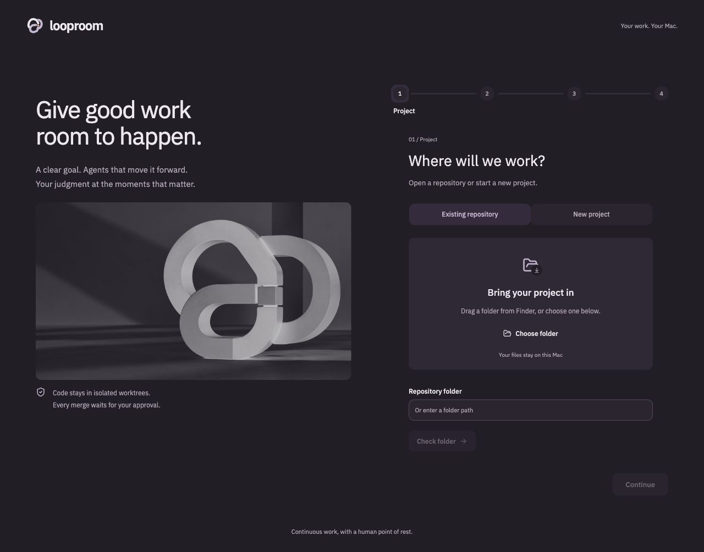

# Getting started

## Requirements

| Requirement | Why |
|---|---|
| macOS | Native folder picker and worker/check sandbox |
| Node 22.13 or later | Built-in SQLite and local coordinator |
| Git 2.35 or later | Isolated worktrees |
| Codex CLI 0.159.2 or later, with named permission profiles | Agent transport and worker boundaries |
| Apple Command Line Tools | Compile the Swift folder picker on first use |
| GitHub CLI, authenticated | Publish and merge PRs; optional for initial local setup |
| Google Chrome | Optional fixed browser-evidence recipe; not downloaded automatically |

Install Codex using [OpenAI's official CLI instructions](https://learn.chatgpt.com/docs/codex/cli). If Command Line Tools are missing, run `xcode-select --install`. Install GitHub CLI from its [official installation guide](https://cli.github.com/) and run `gh auth login` when you are ready to publish.

```sh
git clone https://github.com/thiago-ss/looproom.git
cd looproom
npm ci
npm run dev
```

Open **http://127.0.0.1:5173**. Vite serves the interface; the coordinator binds to **127.0.0.1:4319**. Keep the terminal open.

## Your first goal



1. Pick an existing Git repository with an initial commit, or a parent folder for a new project. The Finder picker and folder drop do not upload the folder's contents. If the browser conceals the dropped path, the native picker confirms it.
2. Select **Sign in with ChatGPT**. Looproom uses a separate account directory; your desktop app's login is not copied. Complete the browser flow. You can connect later in Settings.
3. Enter a specific outcome and exclusions. Start small: a reproducible bug or a bounded feature is easier to review than “improve everything.”
4. Choose models available on your account. Defaults are GPT-6.1 Sol / High for orchestration and GPT-6 Sol / Medium for implementation, research, independent review and judging. Changes apply to future runs. Access is verified by actual inference, not just by a catalog entry.
5. Configure the check commands you authorize in task worktrees, then start the loop. The first planning run is read-only.

Agents start from committed code. Uncommitted human changes remain in the original checkout. Publishing needs a GitHub `origin` and an existing remote base branch.

ChatGPT sign-in uses your account's applicable Codex access and limits. Model calls are remote; local storage does not mean offline inference. [Official authentication reference](https://learn.chatgpt.com/docs/auth).

## Decisions and PRs

**Human review** keeps judge drafts for you. **Judge bypass** answers routine escalations automatically. **YOLO** drafts and submits non-PR replies and can attempt scoped recovery under the existing permissions. All modes keep PR merging human-only. Restart interruption gates also stay in human review.

Goal records the agent's escalation before its attributed response. Other ready work can continue while a task waits. A real missing capability can remain blocked; automatic replies are not a guarantee that it is resolved.

In Review, inspect the diff, checks, separate reviewer evidence and exact head revision. **Approve & merge** rereads GitHub and submits that head SHA atomically. Conflicts, changed revisions, and failed or pending checks prevent merge. PRs created elsewhere can be imported through Review; import does not fabricate native verification.

## Launch a built copy

```sh
npm run build
npm start
```

Open **http://127.0.0.1:4319**. You can also double-click `Looproom.command`. The launcher checks prerequisites, installs locked dependencies when necessary, builds changed sources, reuses matching builds, and opens a healthy local coordinator when found. This is a local web app, not yet a signed native package.

One coordinator owns each data directory. A conflicting process or occupied port produces an error rather than silently starting a second owner. Do not run a second coordinator against the same directory.

| Variable | Default |
|---|---|
| `LOOPROOM_DATA_DIR` | `~/Library/Application Support/Looproom` |
| `CODEX_BINARY` | `codex` on PATH |
| `PORT` | `4319` |

## Recovery and dependencies

Closing the terminal or shutting down interrupts active work. Worktrees and SQLite state remain. On restart, review and resolve the interruption gates before continuing. Sleep suspends work; the launcher cannot make it run through sleep.

For npm projects, matching lockfiles let the broker copy already-installed local dependencies into a task worktree without network access or lifecycle scripts. Missing packages or changed locks needing installation create a capability gate. There is no broad-access installation fallback.

Configured checks run in disposable worktree copies through a separate macOS sandbox. The runner permits fixture cleanup and loopback test servers while denying Internet access, coordinator ports, original checkout writes and known credentials. The current runner uses deprecated `sandbox-exec`; a signed replacement remains packaging work.

## Notifications and memory

Settings controls escalation sound and opt-in desktop alerts. Sound needs an initial browser interaction; desktop alerts need browser permission. The persistent inbox still works when these are unavailable. Delivered alerts are deduplicated across supported same-origin tabs.

SQLite owns live state. Completed outcomes create immutable raw records, hashes and cited wiki pages under application data. FTS5 powers project memory search. Conflicting structured claims remain explicit until evidence can resolve them. Private project memory is not part of this public repository; do not share it wholesale in bug reports.

## Troubleshooting

- **Coordinator unavailable:** check the running terminal and whether ports 5173/4319 are occupied. Restart the same installation rather than launching another owner against its data.
- **Model unavailable:** select a model your account can actually use. Looproom does not silently substitute it.
- **PR missing:** check the project/remote association, then use Review's external PR import.
- **Merge refused:** inspect the displayed head, checks and conflicts. Reconcile and review the new revision; a prior approval does not transfer.
- **Blocked after a judge reply:** read the actual reply and capability evidence. A wait response preserves the blocker while unrelated work continues.

For reproducible problems, use the [bug report template](https://github.com/thiago-ss/looproom/issues/new/choose) and remove private paths, prompts, account identifiers and secrets.
